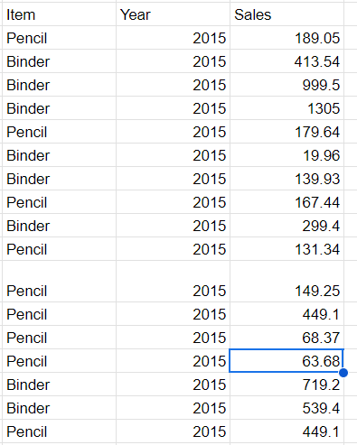
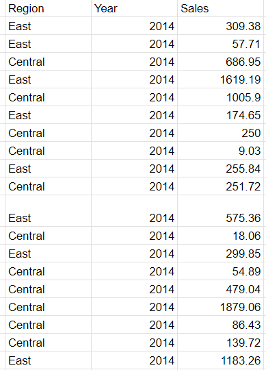
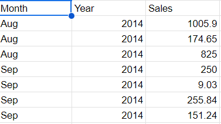
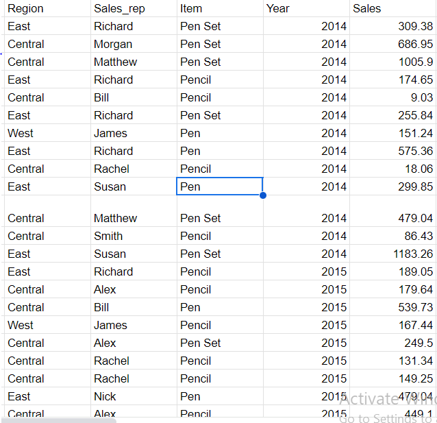
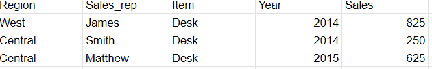

# Skilharvest-Data-Documentation

## Project Overview

This Data analysis aims to generate insight into the sales performance of the E commerce project over the past year. By analysing the various parameters in the dat received we seek to gather enough insight to make reasonable decisions which then enable us to tell compelling stories around our data from the insight gotten and to know the best performance from our data.

## Data Sources
The primary source of Data used here from SkilHarvest Stationary Supplies.csv was shared during the training program

## Tools Used
- The tool used for the analysis is the Google Query Sheet

## Data Cleaning and Preparation

Exploratory Data Analysis involve exploring the data to answer some question about the Data such as;
- Sales of binder items and pencil in 2015.
- Sales in Central and East region in 2014.
- Sales in August and September 2014.
- Sales of items that start with Pen, include their region, sales rep and year.
- Sales of items that end with ‘sk’, include their region, sales rep and year.

## Data Analysis
These are the query used to answer the above questions
---
Google Query Sheet
---

=QUERY(A:H, "SELECT C,F,H WHERE (C='Binder' OR C='Pencil') AND F=2015", 1)

---

---

=QUERY(A:H, "SELECT A,F,H WHERE (A='Central' OR A='East') AND F=2014", 1)

---

---

=QUERY(A:H,"SELECT E,F,H WHERE (E='Aug' OR E='Sep') AND F=2014", 1)

---

---

=QUERY(A:H, "SELECT A,B,C,F,H WHERE C LIKE 'Pen%'", 1)

---

---

=QUERY(A:H,"SELECT A,B,C,F,H WHERE C LIKE'%sk'", 1)

---

## Results/Findings

The insight gotten from the analysis are shown below

---

---

---

---

---

